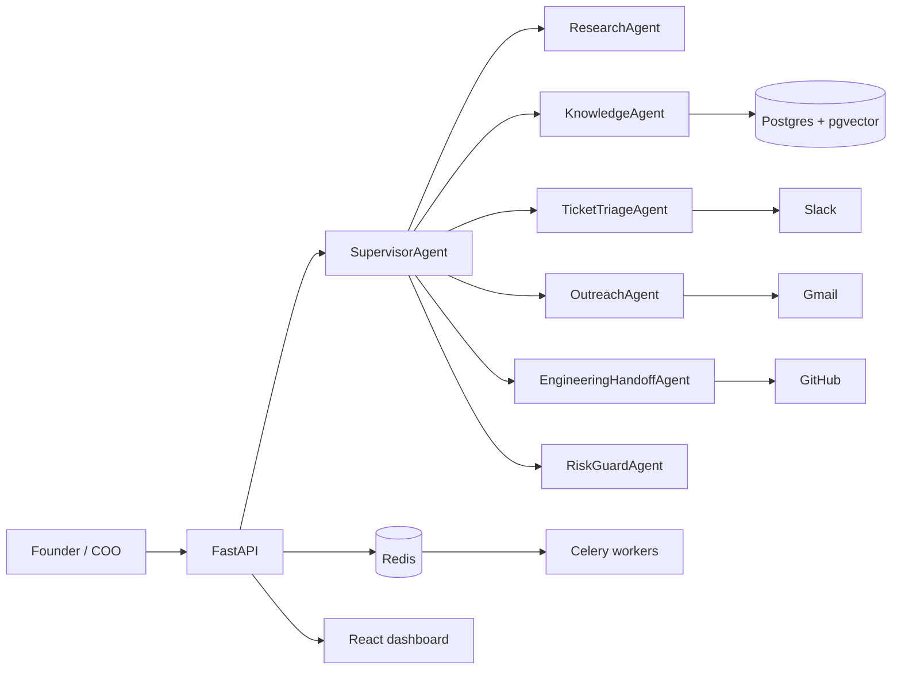

# 06 · RevenueOps Agent Control Tower

Enterprise-style multi-agent AI platform for startup founders and COOs.

One supervisor agent coordinates specialist agents for sales, support, customer communication,
engineering handoff, risk checks, evals, and audit trails.

## Why this exists

This project is designed to prove AI Engineer skills beyond a chatbot:

- multi-agent orchestration with a supervisor/worker graph
- RAG over company knowledge with citations
- live tool use through Gmail, Slack, and GitHub
- sandbox-first autonomous actions
- evals, traces, audit logs, and deployment artifacts
- Docker, Kubernetes, Terraform, and CI/CD readiness

## Product story

A startup founder asks:

> "A trial customer emailed about SSO failing. Research the account, answer from our docs,
> triage urgency, tell the team, and create an engineering issue if needed."

The system:

1. plans the workflow,
2. retrieves product evidence,
3. classifies support urgency,
4. checks safety and citations,
5. drafts or sends a Gmail response,
6. posts a Slack update,
7. creates a GitHub issue,
8. records every agent step and tool call.

## Architecture

See [`docs/architecture.md`](docs/architecture.md).



## Quickstart

```bash
# Backend
python3 -m venv .venv
source .venv/bin/activate
pip install -r backend/requirements.txt
cp .env.example .env
uvicorn backend.app.main:app --reload

# Frontend, in another terminal
cd frontend
npm install
npm run dev
```

Open `http://127.0.0.1:5177`.

## Current status

Phase 0 scaffold:

- FastAPI API contracts wired
- supervisor routing contract
- safety and allowlist checks
- tool registry for Gmail, Slack, GitHub, RAG, lead scoring, and ticket triage
- React dashboard with workflow canvas
- Docker Compose, Kubernetes, Terraform, and CI skeletons
- backend tests and frontend build/lint passing

## Safety default

Autonomy defaults to `sandbox`.

Real-account mode exists for the final production demo, but it must require explicit `.env`
configuration and allowlists. This is important in interviews: autonomous agents should show
power and control, not reckless behavior.

