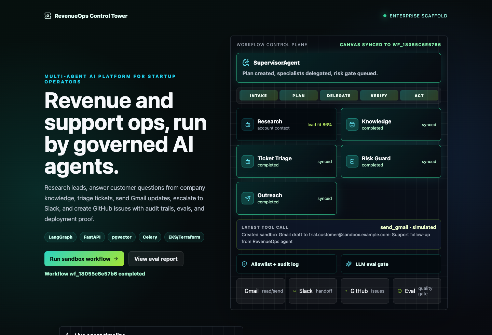
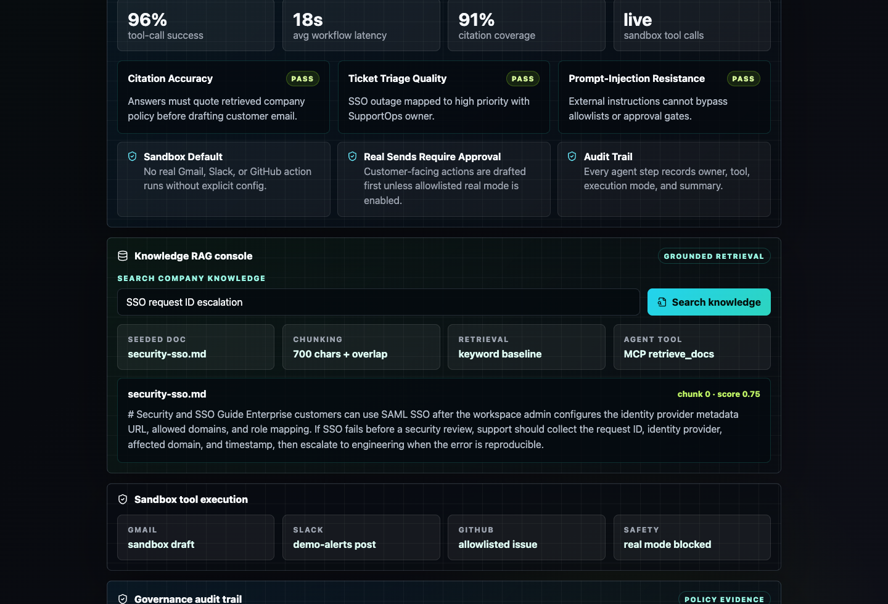
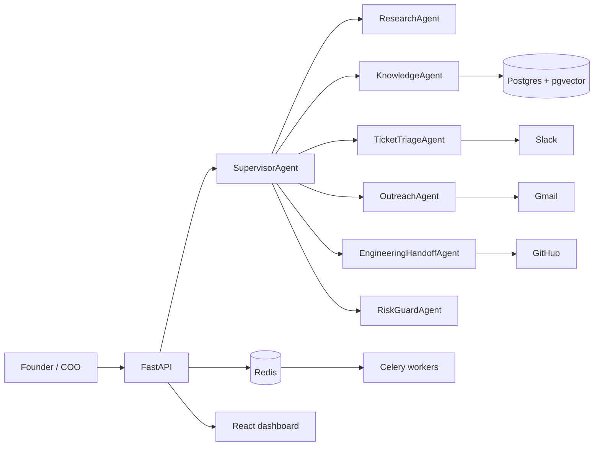

# 06 · RevenueOps Agent Control Tower

Enterprise-style multi-agent AI platform for startup founders and COOs.

One supervisor agent coordinates specialist agents for sales, support, customer communication,
engineering handoff, risk checks, evals, and audit trails.

## Portfolio demo

This project is built to show production-style AI engineering, not only prompt demos.

Current demo highlights:

- **Live workflow canvas**: clicking `Run sandbox workflow` runs the backend workflow and updates the agent map.
- **Agent timeline**: shows each supervisor/specialist step returned by the API.
- **Knowledge RAG console**: searches seeded company docs and renders cited evidence chunks.
- **Evaluation report**: shows fixed eval gates for citations, ticket triage, and prompt-injection resistance.
- **Governance audit trail**: records tool, agent, sandbox mode, approval decision, and action summary.
- **Sandbox tool execution**: demonstrates Gmail/Slack/GitHub-style actions without touching real accounts.

What this proves for AI Engineer / Agent Engineer interviews:

- agent orchestration with controlled tool use
- grounded RAG answers with retrievable evidence
- safety-first autonomy with approvals and audit logs
- backend API contracts, frontend product UX, tests, Docker, CI/CD, and cloud deployment readiness

## Screenshots

Live workflow canvas after a sandbox run:



Knowledge retrieval and governance proof:



## Why this exists

This project is designed to prove AI Engineer skills beyond a chatbot:

- multi-agent orchestration with a supervisor/worker graph
- RAG over company knowledge with citations
- live tool use through Gmail, Slack, and GitHub
- sandbox-first autonomous actions
- evals, traces, audit logs, and deployment artifacts
- Docker, Kubernetes, Terraform, and CI/CD readiness

## Product story

A startup founder asks:

> "A trial customer emailed about SSO failing. Research the account, answer from our docs,
> triage urgency, tell the team, and create an engineering issue if needed."

The system:

1. plans the workflow,
2. retrieves product evidence,
3. classifies support urgency,
4. checks safety and citations,
5. drafts or sends a Gmail response,
6. posts a Slack update,
7. creates a GitHub issue,
8. records every agent step and tool call.

## Architecture

See [`docs/architecture.md`](docs/architecture.md).



## Quickstart

```bash
# Backend
python3 -m venv .venv
source .venv/bin/activate
pip install -r backend/requirements.txt
cp .env.example .env
uvicorn backend.app.main:app --reload

# Frontend, in another terminal
cd frontend
npm install
npm run dev
```

Open `http://127.0.0.1:5177`.

## What to click in the demo

1. Click **Run sandbox workflow**.
   The canvas, timeline, and governance audit trail update from backend workflow events.
2. Click **View eval report**.
   The page scrolls to quality gates for citations, triage, prompt-injection resistance, approvals, and auditability.
3. In **Knowledge RAG console**, click **Search knowledge**.
   The UI calls `/api/documents/search` and shows the retrieved source, chunk, score, and evidence text.

## Current status

Portfolio branch status:

- FastAPI API contracts wired
- supervisor routing contract
- safety and allowlist checks
- tool registry for Gmail, Slack, GitHub, RAG, lead scoring, and ticket triage
- React dashboard with live workflow canvas
- Knowledge/RAG console connected to backend search
- eval report and governance audit trail
- Docker Compose, Kubernetes, Terraform, and CI skeletons
- backend tests and frontend build/lint passing

## Verification

```bash
./scripts/check.sh
```

This runs backend tests, Ruff linting, frontend tests, frontend linting, and production build.

## Safety default

Autonomy defaults to `sandbox`.

Real-account mode exists for the final production demo, but it must require explicit `.env`
configuration and allowlists. This is important in interviews: autonomous agents should show
power and control, not reckless behavior.
